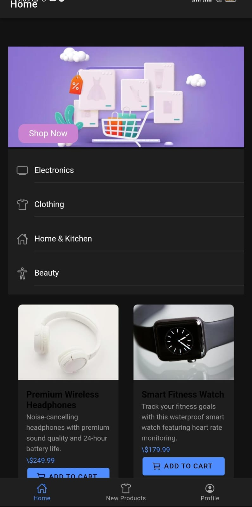

# Ionic E-Commerce App

This repository contains an e-commerce application built using Ionic and Angular, targeting the Android platform with Capacitor. The app is a simple project designed to practice learned concepts and can be improved to be more scalable and flexible.

## Features

- **Home Page**: Displays a list of categories and featured products.
- **Products Page**: Showcases all available products with sorting and filtering options.
- **Profile Page**: Allows users to view and edit their profile information.

## Technology Stack

- **Framework**: Ionic
- **Frontend**: Angular
- **Languages**: 
  - TypeScript (56.2%)
  - HTML (19.2%)
  - SCSS (15.2%)
  - JavaScript (4.9%)
  - Java (4.5%)
- **Mobile Platform**: Android (via Capacitor)

## Screenshots

### Home Page


### Products Page


### Profile Page


## Installation and Setup

To run this project on your local machine:

1. Clone the repository:
   ```bash
   git clone https://github.com/HADDANIAbdu/ionic-ecommerce-app.git
